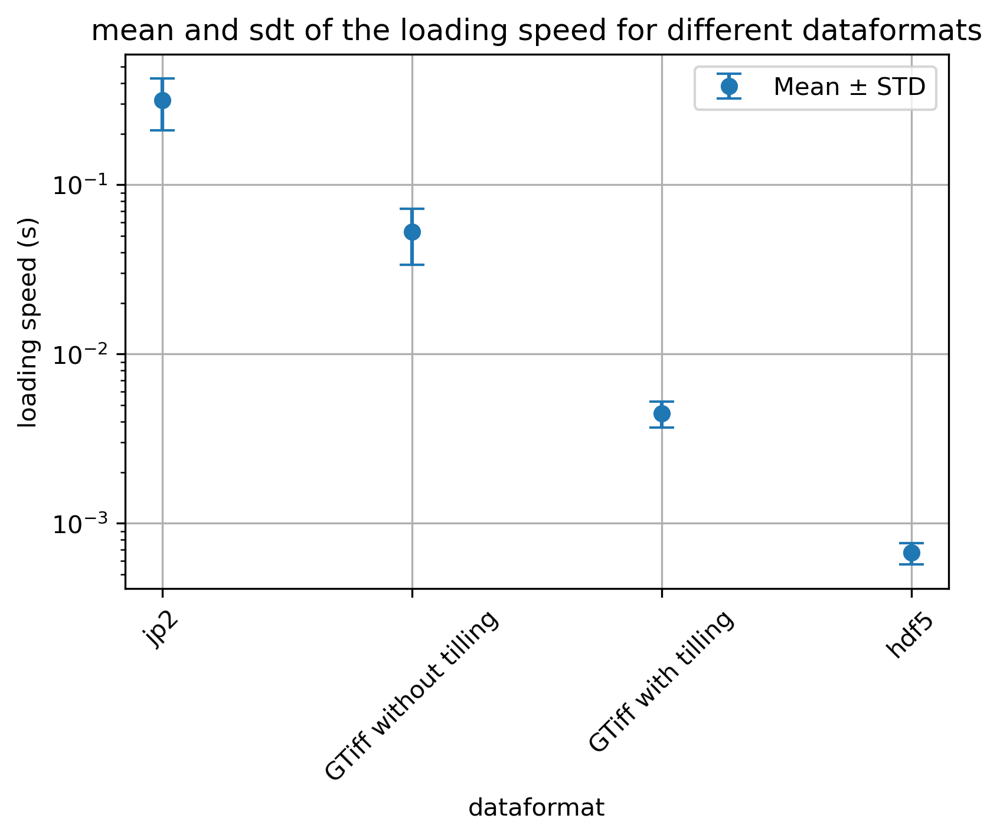

# Comparison for reading speed of satellite raster data for fast deep learning data loader

Data like Sentinel-2 satellite images comes in compressed .jp2 separate tiles per band covering big spacial extends. Loading patches (windows) via *rasterio* can be very slow and therefore represent the bottleneck of a machine leaning pipeline. Alternatively, one can extract patches beforehand and store them separately or in a combined hdf5 file. Still, this generates storage overhead and makes visualization more difficult (large rasters can be more easily displayed).

The notebook in this repo compares the speed for loading tiles from a big 10980 x 10980 Sentinel-2 raster file with various strategies and compares it to the loading speed on obtains by comparing to preprocessing the data into patches beforehand.

**Loading direct from the 100km² x 100km² Sentinel-2 tiles**

* Default .jp2 separate file per band (up-sampling on the fly)
* Transfer all channels into one big GeoTiff 
* Using internal tiling for the GeoTiff  

**Preprocessing (tilling) the data beforehand**

* Saving all tiles beforehand in a hdf5 file  

# Preparations

You have to download the Sentinel-2 file  **S2B_MSIL2A_20230928T101719_N0509_R065_T32UPU_20230928T145710.SAFE** 
from https://dataspace.copernicus.eu/ and put it directly into the directory of the notebook.

# Results in a nutshell

* Statistics over 1024 load operations with a i3-10105 @ 3.70GHz CPU.

* Storage is given in GB for roughly 1764 patches with is the 42² patches you get when tiling the 10980 x 10980 Sentinel-2 raster with a 256 patch size. (Done this way so we can compare to the hdf5 setup)

| Method                                                       | Avg Time | Storage for ~1764 patches |
| ------------------------------------------------------------ | -------- | ------------------------- |
| Separate .jp2 file per band. Up-sampling while loading.      | 0.316 s  | 1.2 GB                    |
| One GeoTiff with all band (up-sampling does not happen anymore while loading the data) | 0.046 s  | 2.9 GB                    |
| GeoTiff with tiled=True option                               | 0.0042 s | 2.9 GB                    |
| Individual samples stored in a hdf5 file                     | 0.00069  | 2.8 GB                    |

# Takeaway

* Writing every band into a common geotiff and using the tilling flag already provides significant speedup.

* Storing individual preprocess patches is even faster but less flexible if you want to have the ability to drag the data into visualization software like QGIS. Therefore only recommanded when tiled Geotiffs still do not utilize the complete GPU.

  

